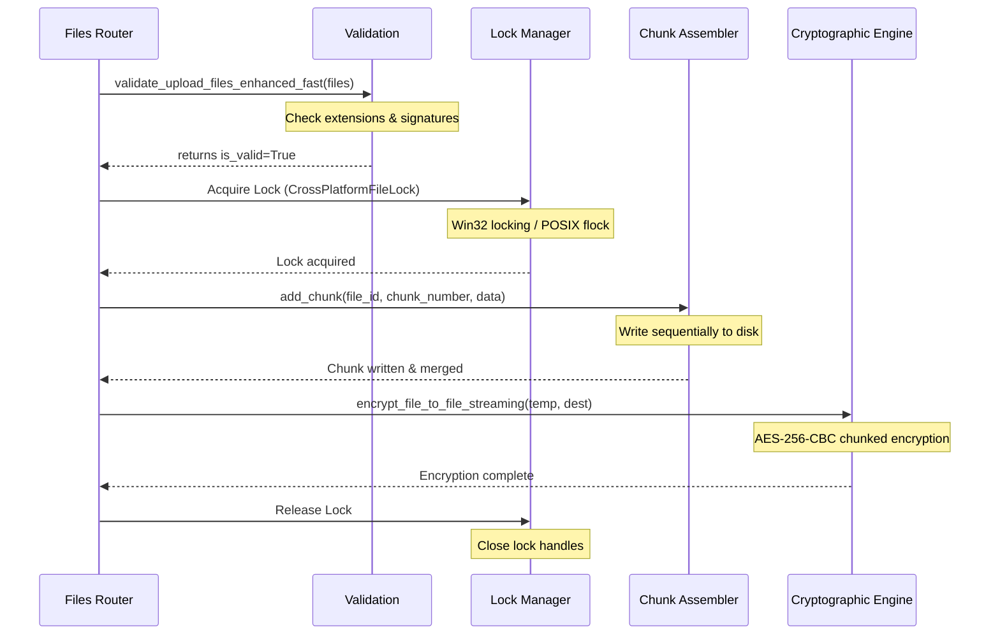

# Lanvan Core Logic Layer Developer Documentation

Welcome to the `app/core` folder! This directory houses the core business logic, cryptographic engines, concurrency lock managers, validation systems, and platform optimization scripts that run the Lanvan file-sharing server.

---

## Directory Map & Module Responsibilities

```
app/core/
  ├── aes_utils.py                 # AES-256-CBC cryptographic streaming & key derivation
  ├── validation.py                # Concurrent async file validation & signature checking
  ├── metadata_protection.py       # Deterministic filename hashing & size padding
  ├── file_locking.py              # Cross-platform file locking (Win32 vs POSIX flock)
  ├── streaming_assembly.py        # Queue-buffered file chunk reassembly on disk
  ├── concurrent_upload_manager.py # Async concurrent upload queue with adaptive workers
  └── windows_file_manager.py      # Win32 DLL locked handle release & file unlinking
```

---

## Module Specifications

### 1. Cryptographic Engine (`aes_utils.py`)
This module handles all symmetric encryption and decryption operations using the `cryptography` library. It implements **AES-256-CBC** with PKCS7 padding.

#### Key Structures
* **`AESConfig`**: Central validation class. Contains iteration specifications and size boundaries.
* **`AES_CONFIG`**: Global configuration dictionary containing chunk sizing (default `64KB`) and flags.

#### Key Functions
* **`generate_secure_key(password: Optional[str], salt: Optional[bytes]) -> Tuple[bytes, bytes]`**:
  Derives a 256-bit AES key using **PBKDF2HMAC** with SHA-256 and 100,000 iterations. Returns a tuple of `(key, salt)`.
* **`encrypt_file_to_file_streaming(input_path: str, output_path: str, user_password: Optional[str], chunk_size: int) -> Dict[str, str]`**:
  Streams blocks of data from `input_path` directly to `output_path`, padding the final block. Constant memory footprint.
* **`encrypt_file_generator_streaming(file_data: bytes, user_password: Optional[str], chunk_size: int)`**:
  A generator function that yields encrypted chunks on the fly. Used by FastAPI to stream encrypted downloads directly to clients.
* **`decrypt_file_stream(encrypted_data: bytes, metadata: Dict[str, str], user_password: Optional[str], chunk_size: int) -> bytes`**:
  Streams decrypted blocks back into memory, unpadding the final chunk.

---

### 2. Validation & Security (`validation.py`)
Responsible for ensuring uploaded files do not threaten the host system. It runs content validation to detect extension spoofing (e.g. executing `.exe` renamed as `.txt`).

#### Key Structures
* **`AdvancedFileValidator`**: Houses configuration lists:
  * `BLOCKED_EXTENSIONS`: Executables, macros, script extensions (e.g. `.exe`, `.cmd`, `.xlsm`, `.bat`).
  * `FILE_SIGNATURES`: Mapping of file magic bytes (e.g., `b'%PDF'` -> `.pdf`) to check content validation.
  * `DANGEROUS_SIGNATURES`: Explicit signatures that trigger an immediate block (e.g., `b'MZ'`, `b'\x7fELF'`).

#### Key Functions
* **`validate_upload_files_enhanced_fast(files: List[UploadFile]) -> Tuple[bool, List[str], List[Dict], List[str]]`**:
  Uses `asyncio.gather` to validate multiple uploads concurrently:
  1. Validates filename lengths and checks extensions against `BLOCKED_EXTENSIONS`.
  2. Runs non-blocking async size queries via `asyncio.to_thread` seeking to the end of the file.
  3. Returns `(is_valid, errors, validated_files, warnings)`.
* **`secure_filename(filename: str) -> str`**:
  Sanitizes input filenames to prevent path traversal attacks (e.g. removing `../` patterns).

---

### 3. Privacy & Metadata Protection (`metadata_protection.py`)
Ensures files transferred over unencrypted channels are not identifiable by analyzing traffic size patterns or names.

#### Key Functions
* **`generate_secure_filename(original_filename: str, encryption_key: bytes) -> str`**:
  Uses salted SHA-256 hashing (salting the original filename bytes with the encryption key) to deterministic-hash the filename to prevent name leaks.
* **`obfuscate_file_size(actual_size: int) -> int`**:
  Adds a random padding size (1KB to 64KB, or up to 1% for files >100MB) to the payload to disrupt packet length analysis.
* **`encrypt_metadata(metadata: Dict, encryption_key: bytes) -> str`**:
  Serializes and encrypts metadata dictionaries (like original size and filename) into an AES Base64-encoded string.

---

### 4. File Lock Manager (`file_locking.py`)
Prevents file write collisions during multi-client concurrent uploads.

#### Key Structures
* **`CrossPlatformFileLock`**: Context manager which automatically acquires and releases files.
  * **Windows implementation**: Uses `msvcrt.locking(fd, msvcrt.LK_NBLCK, size)` (non-blocking).
  * **Unix/Android implementation**: Uses `fcntl.flock(fd, fcntl.LOCK_EX | fcntl.LOCK_NB)`.
  * **Fallback**: Uses atomic file creation mode (`x+b`). Handles stale locks by checking file ages (automatically cleans locks older than 5 minutes).

#### Usage Example
```python
from app.core.file_locking import CrossPlatformFileLock

lock = CrossPlatformFileLock("app/uploads/file.lock", timeout=10.0)
async with lock:
    # Safely perform file operations
    pass
```

---

### 5. Chunk Assembly System (`streaming_assembly.py`)
Assembles uploaded file chunks in real-time. It uses an active memory threshold matching Termux configurations.

#### Key Structures
* **`StreamingFile`**: Dataclass representing the state of a chunked upload session (total chunks, received chunk indices, paths).
* **`StreamingChunkAssembler`**: Class managing active chunk merges:
  * Employs on-disk sequential writing. When chunks are received in order (e.g. chunk 1, then chunk 2), it writes them directly to the destination file, immediately releasing bytes from RAM.

---

### 6. Concurrent Uploads Manager (`concurrent_upload_manager.py`)
Coordinates multiple files uploading concurrently. It interfaces with the platform optimizer to regulate worker loops.

#### Key Structures
* **`ConcurrentUploadManager`**: Manages execution state.
  * Employs an `asyncio.Queue` and semaphore loops to process chunks concurrently.
  * Automatically coordinates memory cleanups (`gc.collect`) when size thresholds are breached.

---

### 7. Windows File Manager (`windows_file_manager.py`)
Handles Windows-specific file locks and unlinking problems.

#### Key Structures
* **`WindowsFileManager`**: Uses Win32 API calls via `ctypes` to clear locked file handles and handle long paths (>260 characters).
  * **`safe_delete_file`**: Implements safe delete loops with garbage collection pauses to release OS locks before deleting files.

---

## Core System Upload & Processing Flow

The following diagram illustrates how a file upload request flows through the core module components:



---

## Developer Guidelines

1. **Bare `except:` Prevention**: Never catch base exceptions using a bare `except:`. Always use `except Exception:` or specify the expected exception classes (e.g., `except OSError:`).
2. **Resource Disposal**: Ensure all context managers (`with`, `async with`) or manual handles are closed inside `finally:` blocks.
3. **Platform Check**: Any Win32 DLL or Unix `fcntl` module imports must be guarded with `ImportError` checks and fallback alternatives (like atomic file locks).
